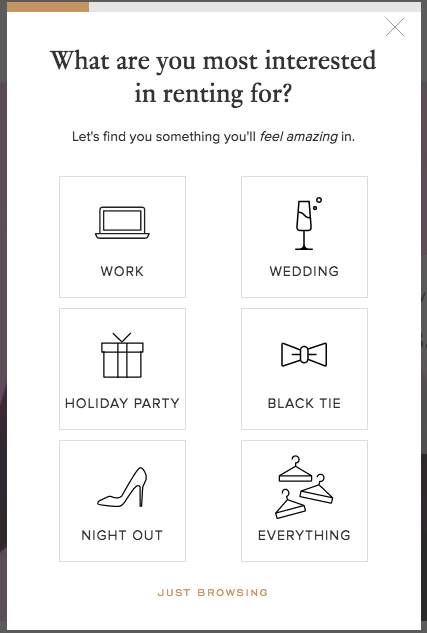

## Abstract

During my PhD presentations, several questions were asked which were related to the difference between personalisation and customisation. Several researchers and students were using these two concepts synonymously. While the goal of these two concepts may overlap, these two differ in their approach, context and implementations. In this article, I want to clarify readers about the difference and similarities between these two.  

#### Keywords:

Personalisation, Customisation, Individualisation, Differentiations

### Introduction

Personalised and customised content has been shown to deliver more dynamic experiences, more user engagements, higher conversion rates, and better customer satisfaction. Two ways help to gear up web applications or mobile applications to achieve a higher degree of user engagement: personalisation and customisation.

For example, see the figure below to understand the difference between customization and personalization.

 

In this context, a personalised app would automatically decrease my application volume, maybe using machine learning algorithms or personalised user profile. A customised app would provide me with an interface where I can decrease the volume. To point out explicitly, customisation requires user intervention. Personalisation auto initiates the system based on user preferences and needs. For example, in this study [<a href="#fn1" id="ref1">1</a>], we use <code>Natural Language Processing</code> to build personalised treatment of mental health problems using patient-authored text data.

# Personalisation

It refers to instruction that is placed to learning needs, tailored to learning preferences, and tailored to the specific interests of different learners.

- Personalisation includes differentiation and individualisation.
- In personalisation, there are different objectives for each learners.
- Personalisation aim to create the strong user experience both on and offline by predicting/anticipating the user's crucial needs.
- Personalisation delivers different content segment to different user segments automatically, and it puts control in the hands of the customer for system being used.
- Personalisation uses user segmentation such as individual traits, behaviour, geographic, demographic and psychographic.
- Personalisation is the data/content severed level.

### What are the advantages of personalisation?

- It doesn't require any extra effort on the user, since the system adjusts the content to the user needs.
- Personalisation helps to filter out the irrelevant content, it tends to deliver a better user experience than an non-personalised site.

### What are the disadvantages of personalisation?

- Personalisation raises questions of privacy.
- Personalisation is built on the top of user profiling. If a system miss to mark correct user interaction, it is difficult to deliver relevant content to the user. This might create a possibility to detract users from the website rather than engaging them.

## Types of personalisation based on segmentation

Segmentation is about groups. These groups are created up of people who share similar characteristics. For example, a) users with same demographics (age, gender, occupation, or income), b) sales stages (awareness, evaluation, loyalty, purchases), c) personas, and others. An essential question to be asked is, <q>why should we care about segmentation? </q> To comprehend, segmentation allows us to target people in smaller, bite-sized chunks. For example, a company can send email to all people over 50 years of age with blog information about the advantages of consuming newly launched vitamin products. By segmenting these people, we can target each segment separately and tailor information, their presentation and structures according to their most likeliness to increase user engagements.

<blockquote>
Simply put, Personalisation is controlled by rules and machine-learning. Segmentation is controlled by the marketer, analysts and managers.  
</blockquote>

### Role-based

Users are grouped together according to certain characteristics that are well-defined in advance. This is most common on Intranets where HR databases holds substantial data about each employee.

### Individualised personalisation

It refers to instruction that is placed to the learning needs of different learners.

- Learning goals are same for all students, but student can progress through the material at different speeds according to the their learning needs.
- With individualised personalisation, the computer system or system is programmed to create a profile of each individual site visitor, based on user interaction.
- The computer used this user profile information to tailor site content or features that particular user's interests.
- Examples: - Amazon purchase suggestions - Netflix recommended TV shows or movies. - Spotify playlists - Pandors playlists

## Types of personalisation based on approach

### Rule-based

They rely on user segmentation model where users are divided into several categories. Based on their individual traits, content is recommended to the particular groups.

### Machine-learning (ML)

ML based personalisation is in hype these days. It requires creating a predicting model that consumes previously stored data and makes a prediction for when new data comes in. If you want to know more about ML, it is just a google away.

<blockquote>
  According to Netflix, 75% of the their views come from personalised recommendations.
</blockquote>

- Push notifications
- Location based personalisation
- personalised features

# Customisation

Customisation is the action by a user of modifying something to suit a particular individual need or task. It puts control in the hand of the users by letting them explicitly choose what kind of content or features they want to see. A customised system enable users to make changes to their experience themselves, by tweaking the content they see, or work with.

Main Assumptions: Users know best what their goals and needs are.

- Examples: BBC's Android app, Google News app

 

- Customisation is at a generic feature level, where you see/hide and others.

### What are the advantages of customisation?

- It enhances user experiences by allowing users decide exactly what they want to see. The system can deliver exactly the same content user wants to see.
- It suits well for users who are sceptical towards personalisation.

### What are the disadvantages of customisation?

- It requires extra user interactions. User interaction imposes higher interaction cost. Users have to put in time to set their preferences, experience, and filter through irrelevant content.
- Users sometime doesn't know what they want or what they are looking for when they land on your website. In such scenario, customisation can be hindrance.
- Too much customisation can create too much confusion for the users.

<blockquote>
  According to a Survey, less than 5% of the users who were surveyed had changed any settings at all.
</blockquote>

You can [read More about the survey](https://archive.uie.com/brainsparks/2011/09/14/do-users-change-their-settings/) from this link.

# Which one is right for you application?

There is no one size fits all approach to customising or personalising any application. It depends on the goals and services your application is delivering.

Personalisation is right approach if your site provides users with a large variety of information, content or product choices that they'll have to wade through to find what they need.

## References

  1. S. K. Mukhiya, U. Ahmed, F. Rabbi, K. I. Pun and Y. Lamo, "Adaptation of IDPT System Based on Patient-Authored Text Data using NLP," 2020 IEEE 33rd International Symposium on Computer-Based Medical Systems (CBMS), Rochester, MN, USA, 2020, pp. 226-232, doi: 10.1109/CBMS49503.2020.00050. <a href="#ref1" title="Jump back to footnote 2 in the text.">↩</a>

