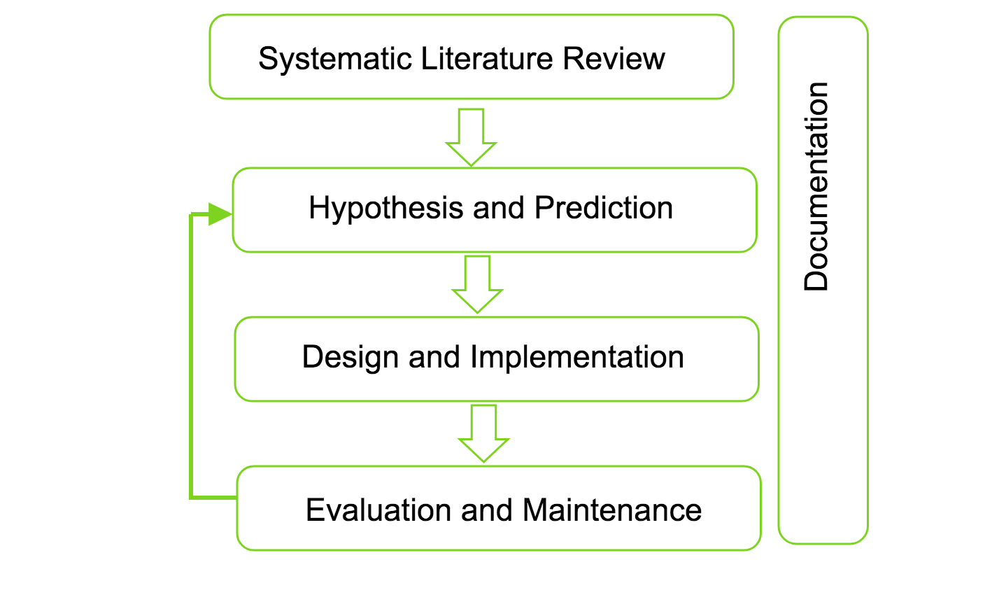

## Abstract

This position paper correlates the philosophy of science with the use of Artificial Intelligence (AI) assisted adaptive technology for providing personalized treatment of mental health problems using adaptive technology. Machine Learning (ML), a subset of AI, provides principled methodologies for the development of automatic, complex, objective algorithmic models for analysis of multi-dimensional and multi-modal biological data. Speech on of such biological data that can be used in automated detection of mental health morbidities with the application of Machine Learning approaches. This aim of my Ph.D. project is to develop an adaptive technology that can be used in providing personalized treatment to mental health problems. In this paper, I examine the philosophical aspects of my project with respect to research methodologies, research approaches, research strategies, and research choices.

### Keywords:

Artificial Intelligence, Philosophy of science, mental health, adaptive technology, induction, research methods

## 1. Introduction

Statistics reveals exceptional incidence of mental health disorders around the world[1], in
Europe [[2](#2), [3](#3)] and in Norway [[4]](#4). Dealing with such mental health patients can be economically [5, 6], physically and emotionally challenging. Several types of researches have been carried
out to facilitate automated and personalized screening and treatment to such mental health patients. Human Brain Project [[1]](#1), eMEN [[2]](#2), and INTROMAT [[3]](#2) are among the European projects that address such mental health problems. In particular, the goal of INTROMAT is to offer personalized treatment for patients suffering from mental and neurological disorders. My project, entitled as Personalized Treatment of Mental Health Problem using Voice is a part of INTROMAT project, where I intend to use human voice as biological marker along with Artificial Intelligence algorithms to detect if a person is suffering from any mental health morbidities. This automation of detecting mental health illness helps to continuously monitor the patients condition on one hand, and create personalized Internet Based Treatments (IBT) on the other.

To relate the main topics of this project, namely Personalized Treatment of mental health problem
using adaptive technology, to philosophy of science, a short overview of philosophy of of science
on the one hand and building adaptive system for mental health problem on the other hand is
required. The following two sections are devoted to give a respective overview. Section [2](#sec2) looks at background of philosophy of science and Machine Learning. Section [3](#sec3) outlines the main research questions of the project. Section [4](#sec4) outlines scientific methodology. Section [5](#sec5) performs the classification of this Ph.D. project based on Philosophy of science.

## 2. Background

The recent rapid growth in Artificial Intelligence (AI) has opened up unprecedented possibilities in analyzing and predicting diverse phenomena including humanities, social and cognitive sciences, finances, healthcare, robotics and other areas of natural sciences. AI is a broader concept that consists of Deep Learning (DL) and Machine Learning (ML). DL is a subset of ML, which is also a subset of AI.

ML is is an important aspects of data science where the goal is to make a rule which takes a data Set A and predicts a data set B. For example, if we have set of voice of patients who are depressed, we can try to predict a new patient has depression or not. The idea is that if we take
a series of complicated functions, then we can find a function which makes accurate predictions.
The notable aspects of ML is the way models are trained and evaluated. A data set is divided into
training data set and test data set. By design, the models are always constructed using training
data set. And the model is evaluated using test data set. The goal is to create an optimal model
that can predict results for the testing set when it has only seen the training set. This task is both _extrapolation_ and _interpolation_. _A good ML model should be able to understand the pattern in the training data and should be able to recognize the same pattern in new data_.

One drawback of ML methods is that even an accurate model does not provide any additional
understanding of the problem. At best, we can find there is relation between X and Y but the model does not explain what is the relationship between them. This understanding is a central matter of philosophy of science. The classic theory of Kuhn [[7]](#7) says, _science is the process of observing the world, making hypothesis based on those observations, and evaluation of those hypothesis by making new measurements_. However, the theory does not take uncertainty into account. All the measurements have certain degree of uncertainty which makes it impossible to sate anything by certainty. ML only cares about accuracy and not about certainty. By these principles, we can proclaim that science is about making accurate predictions as stated by the Bayesian perspective to philosophy of science, we try to find the most likely solutions to scientific problems.

## 3. Research Questions

The primary aim of this research is to come up with adaptive technology that can be used in
both clinical setup and home-based setup for personalized assessment and treatment of mental
health problems. Now we present our research questions and in the following sections we will
present how we address them.

- **RQ1** What kind of voice signal features are taken into considerations in the detection of mental health problems? How can these features be categorized?

- **RQ2** What are the approaches and methodologies used in data collection from the mental health patients? How can these methods be applied to clinical diagnosis?
  1. How can we collect data for the empirical purpose? How can we establish infrastructure
     that can be used in clinical setup? And how will the system be used by mental health
     patients in the daily use?
  2. How can these data be sent to a server? What pre-processing can we perform on the
     terminal devices like mobile and tablets before sending these data to the server?
  3. How can we store the data without violating privacy policy? Can we encrypt or compress the data set in this scenario? What are the protocols for storing, encrypting and storing them?
  4. How can we access this data in the server? What type of visualization can be done on
     the server and how can processed data be shared with others?
- **RQ3** What type of machine learning algorithms that has been applied on physiological dataset for detecting mental health problems such as depression, social anxiety, bipolar disorder, ADHD and others in the state of art works? What evaluation metrics has been used to measure the performance of these algorithms?

- **RQ4** How can we utilize MDSE techniques to build an adaptive system that uses voice signal to diagnose mental health problems and provide personalized treatments? Can the framework be utilized both in a clinical setup and home-based treatment?

  1. How can we create a prototype to show an adaptive system that can be used in the
     treatment process?
  2. How can we use the adaptive system in a clinical setup? How can the treatment be
     adapted based on the recognition?

## 4. Scientific Methodology

An overview of overall organization of the project is illustrated in Figure 1. The overall phase
of the project is divided into five phases.

<figure>
  
  <figcaption style="text-align: center;">Figure 1: Overall organization of the Ph.D. project</figcaption>
</figure>

### 4.1. Systematic Literature Review

Literature review shows that authors have considered parameters including video, text and
physiological sensors to detect the stress level. In order to get the detailed overview of state-of-art researches and background knowledge on the problem domain, a systematic survey will be done. This will provide the groundwork for answering **RQ1** and publishing research paper **RP1**. This initial step of the project is aimed at formulating a set of observations to understand problems and the state-of-art methods for solving them. The comprehension achieved in this step facilitates formulating hypotheses for our research questions.

### 4.2. Hypothesis and Prediction

The literature review provides better insights into the existing problems and solutions, identifies new opportunities and comes up with new ideas. These observations forms the basis for developing hypotheses. Based on these hypotheses we will have predictions that we expect to acquire in our experiments.

### 4.3. Design and Implementation

This step provides experimental design to test and evaluate our hypotheses. The end users can
create a test session using mobile app which stores the sensor data in their local phone memory
and can be synced to the server with a proper consent to respect their privacy. One of the most
important aspects of the research is data collection. Preliminary research showed that there is
a lack of training data that can be used for training a machine learning model. It is one of the
important research questions in **RQ2**, regarding how data can be collected from mental health
patients in a clinical setup. The work will provide the basis for answering research question **RQ2** and grounds for publishing research paper **RP2**.

## 5. Philosophy of Science

As explained in the Scientific Methodology, the main task is the create a ML model that can detect mental illness in patients. Basically, we start by proposing hypothesis which is the initial step in Popper rationalism. We use various parameter estimation and uncertainty quantification for different algorithms to conclude if a given hypothesis is true or false.
Based on the nature of my Ph.D. project, I claim to classify the project in the following categories.

### 5.1. Approaches

As mentioned in the Section [4](#sec4), this project involves collection of observed data and use these data to create model that can induce if a new data follows similar pattern as the observed data. Hence, I claim the Ph.D. project follows inductive approach.

### 5.2. Strategies

In the INTROMAT project, we research about five cases including ADHD, Depression, Bipolar
Disorder, Social Anxiety and gynecological cancer. Hence, the research strategies clearly includes case study. Moreover, based on the detection of mental health conditions of the patients, we will be doing form based surveys and experiments.

### 5.3. Choices

I claim the Ph.D. project involves mixed method of research choices including both qualitative
and quantitative research. To back up the statement, it is already said that we will be collecting voice data from users. Once the voice data is sampled and processed, it is numerical data. Moreover, we will be doing surveys, interviews with the patients, that qualifies for qualitative data. In addition to this, the prediction done by the ML model will be numerical value ( for example depression level ).

### 5.4. Time Horizons

Saunders et al. (2007) [[9]](#9) says, time horizons are needed for the research design and independent of the research methodology used. This project follows cross sectional as the research is carried to a specific time frame and cross sectional time horizon is used. This is due to the fact that, mental health patients requires continuous monitoring over a period of time and expected to get better and live a normal life.

## 6. Conclusion

In this paper, I outlined the philosophical aspects of my Ph.D. project with respect to research
methodologies, research approaches, research strategies, and research choices.

## 7. Acknowledgement

This essay is a part of the Ph.D. mandatory course PCS902- Philosophy of Science and
Research Methodologies. The opinions, findings, discussions, recommendations, and conclusions illustrated in this chapter are those of the authors and do not reflect the views of any
agencies.

<iframe src="https://drive.google.com/file/d/1XLpiXeBNQWQM0y240rJnrYDVKYrWAQQ6/preview" width="640" height="480"></iframe>

## References

1. WHO, World health report (2018). URL http://www.who.int/whr/2001/media_centre/press_release/en/
2. E. Union, Improving the mental health of the population: Towards a strategy on mental health
   160 for european Union, Technical report, Health & Consumer Protection Directorate General.
3. http://www.intromat.no
4. M. Sommer, Mental health among youth in norway, Norden 69 (2016) 7.
5. N. H. E. A. (NHEA), National health expenditure data (2017).
6. D. Bloom, et. al, The global economic burden of noncommunicable diseases, Pgda working papers, Program on the Global Demography of Aging (2012).
   URL https://EconPapers.repec.org/RePEc:gdm:wpaper:8712
7. T. S. Kuhn, The structure of scientic revolutions, The University of Chicago Press.
8. Y. L. Fazle Rabbi, Development of an E-mental Health Infrastructure for Supporting Interoperability and Data Analysis.
9. A. Sahay, Peeling Saunder’s Research Onion, ResearchGatedoi:10.1021/jacs.5b10928
