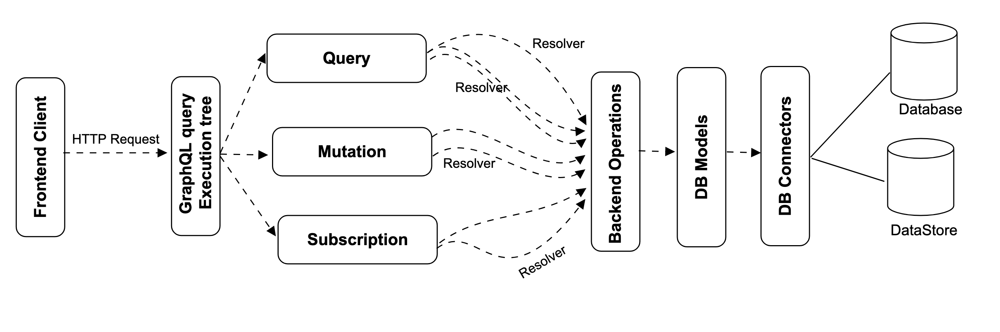
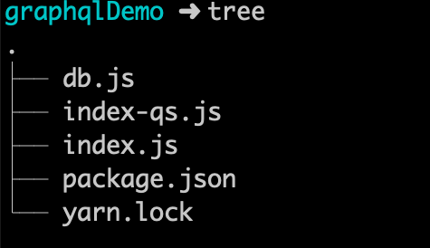
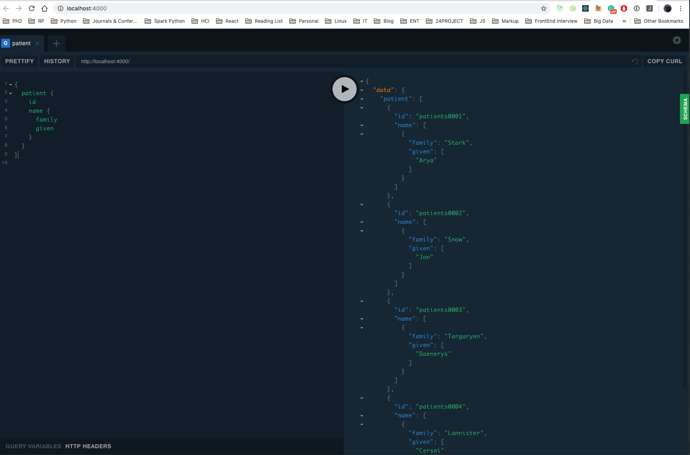

## Abstract

<div style="background-color: #f1f0f0; color: rgba(0, 0, 0, 1); padding: 1rem;font-style: italic;text-align: justify;">
GraphQL is a recently proposed, and increasingly adopted framework for providing a new type of data access interface on the web. The framework includes a graph query language that enables app developers to run queries against server API that traverse a graph of application objects and fetch exactly the right amount and format of data in a single request. Such APIs omit over-as well as under-fetching without the need for specialised servers, thus yielding performance benefits while being reusable. The potential of declarative data fetching have recently triggered discussion on whether a technology like GraphQL is going to replace REST architectural style and its implementation framework. This discussion is also relevant for existing RESTful systems with respect to possibilities of their modifications in order to benefit from declarative data fetching. The main aim of this article is to provide minimalistic background overview of how GraphQL works; what are the major components of GraphQL and finally how to get started with GraphQL.
</div>

### Keywords:

Software service architecture, RESTful, GraphQL, GraphQL architecture, Query, mutations, resolvers.

## 1. Introduction

Back in 2012, Facebook faced a problem while they were developing their mobile applications which led them to create [GraphQL](https://graphql.org/learn/). Following are some of the main features of [[`GraphQL`]](#3):

- **Hierarchical** - queries look exactly like the data they return.

- **Client-specified queries** - the client has the liberty to dictate what to fetch from the server,

- **Strongly typed** - you can validate a query syntactically and within the GraphQL type system before execution. This also helps leverage powerful tools that improve the development experience, such as GraphiQL.

- **Introspective** - you can query the type system using the GraphQL syntax itself. This is great for parsing incoming data into strongly-typed interfaces, and not having to deal with parsing and manually transforming JSON into objects.

## 2. Why to use GraphQL?

There are several reasons why and when one should consider using `GraphQL`. In this section, I am going to present some of the main reasons why `GraphQL` is very beneficial especially for Health Information Exchange (HIE).

### Single endpoint

Let us check one of the most popular REST implementation of [`HL7 FHIR`](http://hl7.org/fhir/resourcelist.html) - [Hapi FHIR](http://hapifhir.io/). Hapi FHIR is `open-source` JAVA implementation of HL7 FHIR and can be downloaded to be installed on custom hosting platform. Let us take an example for `Patients` HL7 FHIR resource.

For Patients resource, they have at least following endpoints:

- `GET`: http://hapi.fhir.org/baseDstu3/Patient?_pretty=true, Get lists of all patients.
- `GET`: http://hapi.fhir.org/baseDstu3/Patient/1427171/_history/1?_pretty=true, Get a single patient resource.
- `POST`: http://hapi.fhir.org/baseDstu3/Patient/_history/1?_pretty=true, Create a patient record.
- `PUT`: http://hapi.fhir.org/baseDstu3/Patient/1427171/_history/1?_pretty=true, Update a patients record,
- `DELETE`: http://hapi.fhir.org/baseDstu3/Patient/1427171/_history/1?_pretty=true, Delete a patient record.

For each HL7 FHIR resource, there can be two scenario:

- `Best Case`: At least create 5 different endpoints as listed above. There are 143 resources listed on HL7 FHIR website, meaning in the best case scenario, one needs to maintain 143 x 5 = 715 endpoints.

- `Worst Case`: There can be more endpoints to meet custom requirements, for example endpoints to fetch only patients from Bergen, Norway, all patients over 40 years old and many more.

One might argue that, we can create a single endpoint with query variables with RESTful approach to get all patients with all conditions. Sure, we can. The point here is:

1. Clients requirements are very dynamic. We can not predict requirements of each and every clients. Moreover, each clients requirements are affected by demographics, company's ethics and rules. Creating or updating existing endpoints every time clients requirements change is inflexible and challenging.
2. Modification of existing endpoints can be risky for existing customers. For example, removing or adding extra attributes to a database table, would require existing customers to modify their request payloads. While it can meet the needs for newer customers, it will create additional tasks for existing customers. At a result of this, RESTful community started API versioning. However, the effect of changes on client, due to API versioning is very costly and challenging. A wonderful article is written about it here [[1]](#1).

Generally, it’s way more convenient and efficient to make a single call instead of multiple calls because it requires less code and less network overhead. More support for increased velocity and developer experience follow in respective sections. Microservices are great but they have some problems of their own. GraphQL can help. Here’s IBM’s experience using GraphQL for microservices:

> All in all, development and deployment of the GraphQL microservice was extremely quick. They started development in May and it was in production in July. The main reason for this was they didn’t ask for permission and just built it. He highly recommends this approach. It is far better than meetings.” — GraphQL at massive scale: GraphQL as the glue in a microservice architecture, Jason Lengstorf (@jlengstorf) of IBM

### Over-fetching

Over-fetching is characterized by fetching more data than actually required by an application. Each extra bits of data is subjective to consuming extra bandwidth in the network increasing cost on one hand and results in performance on the other. A real problem that annoys a lot of developers is over-fetching and under-fetching information through REST APIs. This is because REST APIs always return a fixed structure. We can't get exactly the data that we want unless we create a specific endpoint for that.

### Under-fetching and `n+1` request problems

Under-fetching indicates that a particular endpoint doesn’t give sufficient of the essential data. The client will have to execute supplementary requests to fetch everything it necessitates. This can increase to a situation where a client requires to first get a list of elements but then needs to make one additional request per element to fetch the needed data referred to as `{n+1}` request problem. Each extra request is computationally expensive as well as increases deployment price. Increase is deployment price is more visible when using platform or infrastructure as service like [IBM Watson](https://www.ibm.com/cloud/watson-assistant/pricing/) where cost of usages is determined by number of requests sent to their server.

### Improved performance

Engineers are not the only people benefiting from GraphQL. Users benefit too because performance (real or perceived) can improve due to the following:

- Reduced payload (clients request only things they need without modifications on the backend)
- Multiple requests combined into one which reduces network overhead
- Client caching and backend batching&caching made easier with tooling
- Prefetching (e.g., Apollo prefetching)
- Optimistic UI updates

### Versioning

One of the painful points in REST, in my opinion, is versioning. With REST APIs, it is very common to see a lot of APIs with v1 or v2, but in GraphQL there's no need for it since you can evolve your APIs by adding new types or removing old ones.

In GraphQL, all you need to do to evolve your API is to write new code. You can write new types, queries, and mutations without the need to ship another version of your API.

## 3. Workflow

GraphQL has two types of components:

- Client Side components
- Server Side components

### Server-side components

As shown in figure 1, GraphQL has three main server-side components:

1. **Schema**: A GraphQL schema is at the center of any GraphQL server implementation and describes the functionality available to the clients which connect to it.
2. **Query:** A GraphQL query [[2]](#2) is the client application request to retrieve data from database or legacy API's.
3. **Resolver:** Resolvers provide the instructions for turning a GraphQL operation into data. They resolve the query to data by defining resolver functions. Resolver is a collection of functions that generate response for a GraphQL query. In simple terms, a resolver acts as a GraphQL query handler.

<figure>
  
  <figcaption>Fig.1 - Architecture illustrating how GraphQL works internally</figcaption>
</figure>

### Client-side components

1. **GraphiQL:** Browser based interface for editing and testing GraphQL queries and mutations.
2. **ApolloClient**: Best tool to build GraphQL client applications. Integrates well with all javascript front-end.

The web server is built on NodeJs and Express framework. A request is made to the Apollo GraphQL Server by ReactJS application (built using Apollo Client library) or GraphiQL browser application. The query will be parsed and validated against a schema defined in the server. If the request schema passes the validation, then the associated resolver functions will be executed. The resolver will contain code to fetch data from an API or a database.

## 4. Getting Started with GraphQL

Let us create a very simple `GraphQL` based API endpoints to fetch all the patients information and also get detailed information for a single patient.

### Prerequisite

- Have [`NodeJS`](https://nodejs.org/en/) and [`yarn`](https://yarnpkg.com/en/) installed in your system.

Create a project with following files:

<figure>
  
  <figcaption>Fig.2 - Demo Project Folder Structure</figcaption>
</figure>

1.  Here is content for `package.json` file. All we did is install two libraries `apollo-server` and `graphql`.

```
{
  "name": "graphqlDemo",
  "version": "1.0.0",
  "main": "index.js",
  "license": "MIT",
  "dependencies": {
    "apollo-server": "2.4.8",
    "graphql": "14.2.1"
  }
}

```

2. Create `index.js` file and define schema.

```
const { ApolloServer, gql } = require("apollo-server");
const patient = require("./db");

const typeDefs = gql`
  enum enumNameType {
    official
    usual
    temp
    nickname
    anonymous
    old
    maiden
  }

  enum addressEnumType {
    home
    work
    temp
    old
    billing
  }

  enum addressTypeEnum {
    postal
    physical
    both
  }

  type Patient {
    resourceType: String
    id: ID!
    active: Boolean
    name: [NameSchema]
    gender: String
    address: [AddressSchema]
  }

  type AddressSchema {
    use: addressEnumType
    type: addressTypeEnum
    text: String
    line: String
    city: String
    district: String
    state: String
    postalCode: String
    country: String
  }

  type NameSchema {
    use: enumNameType
    family: String
    given: [String]
  }

  type Query {
    patient: [Patient]
    patientById(id: ID!): Patient
  }
`;

const resolvers = {
  Query: {
    patient: () => patient,
    patientById: (parent, args, context, info) => {
      return patient.filter(item => item.id === args.id)[0];
    }
  }
};

const server = new ApolloServer({ typeDefs, resolvers });

server.listen().then(({ url }) => {
  console.log(`🚀  Server ready at ${url}`);
});

```

3. Create a mock up database file `db.js`.

```
const patient = [
  {
    "resourceType": "Patient",
    "id": "patients0001",
    "active": true,
    "name": [
    {
      "use": "official",
      "family": "Stark",
      "given": [
        "Arya"
      ]
    },
  ],
  "gender": "female",
  "address": [
    {
      "use": "home",
      "type": "physical",
      "text": "The North, Winterfell",
    }
  ],
},
{
    "resourceType": "Patient",
    "id": "patients0002",
    "active": true,
    "name": [
    {
      "use": "official",
      "family": "Snow",
      "given": [
        "Jon"
      ]
    }
  ],
  "gender": "female",
  "address": [
    {
      "use": "home",
      "type": "physical",
      "text": "The North, Winterfell",
    }
  ],
},
{
    "resourceType": "Patient",
    "id": "patients0003",
    "active": false,
    "name": [
    {
      "use": "official",
      "family": "Targaryen",
      "given": [
        "Daenerys"
      ]
    }
  ],
  "gender": "female",
  "address": [
    {
      "use": "home",
      "type": "physical",
      "text": "The Crownlands",
    }
  ],
},
{
    "resourceType": "Patient",
    "id": "patients0004",
    "active": false,
    "name": [
    {
      "use": "official",
      "family": "Lannister",
      "given": [
        "Cersei"
      ]
    }
  ],
  "gender": "female",
  "address": [
    {
      "use": "home",
      "type": "physical",
      "text": "The Westerlands",
    },
    {
      "use": "home",
      "type": "postal",
      "text": "The Crownlands",
    }
  ],
  }
];

module.exports = patient;

```

4. To run the example, execute follow commands in terminal from root folder of the project.

```
yarn
node index.js
```

Your application should run at port `4000` and accessible to your by [localhost](http://localhost:4000/). You should get a browser user interface with playground like figure 3.

<figure>
  
  <figcaption>Fig.3 - GraphiQL playground</figcaption>
</figure>

5. Querying your endpoints.

Let us get the list of patients `name`.

```
{
  patient {
    name {
      family
      given
    }
  }
}
```

Note with single implementation, we can control the attributes we want the endpoint to return. Provided, we are interested in getting `id` of the patients, we can modify the queries to:

```
{
  patient {
    id
    name {
      family
      given
    }
  }
}

```

Let us now query about a single Patient with `id` of `patients0001`. We can modify the quries as:

```
{
  patientById(id: "patients0001") {
    id
    name {
      family
      given
    }
  }
}

```

Download complete working code here. <a href="graphqlDemo.zip">Click here.</a>

I have composed another article about how query is parsed, and validated before executing. [Learn how a GraphQL query is parsed and validated here](/query-parsing-and-validation-in-graphQL/).

#### Here is link to the [second part of the article](/query-parsing-and-validation-in-graphQL).

## 5. Conclusion

GraphQL is a protocol and a query language. GraphQL API can access data stores directly but for most use cases GraphQL API is a data aggregator and an abstraction layer. The layer that improves velocity of development, decreases maintenance and makes developers happier. For these reasons, GraphQL makes even more sense for a public API. GraphQL is meant to be used for client applications, where network bandwidth and latency are critical. It provides clients, the ability to query an object graph (a hierarchical structure of related objects). Using GraphQL, clients also get to choose what fields need to be included in the response. This makes it a whole lot simpler and easier to use and manage data fetching on the client’s end.

## References

1. <a name="1"></a>Li, J., Xiong, Y., Liu, X., & Zhang, L. (2013). How does web service API evolution affect clients? In Proceedings - IEEE 20th International Conference on Web Services, ICWS 2013. https://doi.org/10.1109/ICWS.2013.48
2. <a name="2"></a>https://www.tutorialspoint.com/graphql/graphql_mutation.htm.
3. <a name="3"></a>https://graphql.org/learn/
