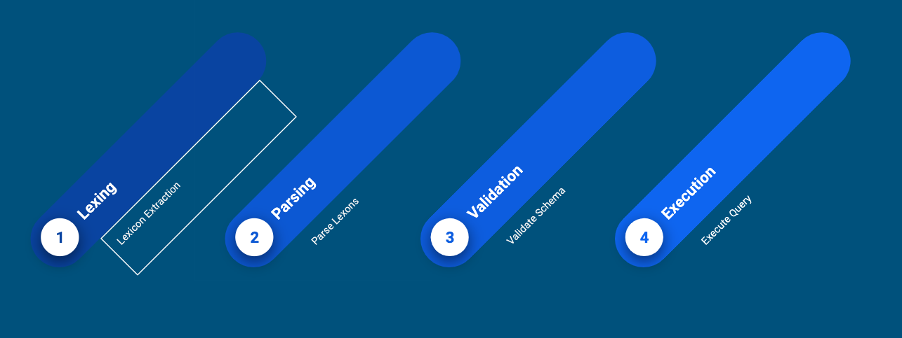

## Abstract

<div style="background-color: #f1f0f0; color: rgba(0, 0, 0, 1); padding: 1rem;font-style: italic;text-align: justify;">
The main aim of this article is to show how a GraphQL query is parsed and validated before execution. Here, I assume the reader knows about what is GraphQL?; how to compose GraphQL  schema?; what is GraphQL query? and what are resolvers,  mutations and subscriptions? If you are not familiar with these concepts, I suggest you read my previous article first.
</div>

### Keywords:

Software service architecture, RESTful, GraphQL, GraphQL architecture, Query, mutations, resolvers.

## 1. Introduction

A few weeks ago, I wrote an article about how to get started with `GraphQL` [[2]](#2) and its main working paradigm. Here is the link to Part 1 of article: [How to get started with GraphQL?](/how-does-graphql-work/). This article uses images extracted from medium post by Christian Joudrey [[5]](#5).

As mentioned [in the previous post](/how-does-graphql-work/), `GraphQL` query systems provides flexibility to the clients to formulate and query backend. Having said that, let us look at GraphQL Query given below:

```
query getPatient {
  Patient(_id: "5cdbe44c25c6150ac290fe87") {
   	id
    resourceType
    name {
      use
      family
      given
    }
    gender

  }
}
```

In order to get results from above query, it undergoes several steps including query parsing, query lexing, query validation and then query execution as shown in figure 1. Let us examine each steps closely.

<figure>
  
  <figcaption style="text-align: center">Fig.1 - GraphQL Query Parsing, Lexing, Validation and Execution</figcaption>
</figure>

## 2. Lexing

When a client execute a GraphQL query (via an `HTTP` Request), the first thing the server needs to do is transform the query into comprehensible format. This process is known as lexing and parsing. Lexing or lexical analysis is the process of breaking up a stream of character into tokens.

<figure>
  
  <figcaption style="text-align: center">Fig.2 - An Example of lexing of a GraphQL Query</figcaption>
</figure>

The rules the GraphQL lexer uses to split up the query are [defined in the GraphQL grammar](https://graphql.github.io/graphql-spec/draft/#sec-Appendix-Grammar-Summary.Lexical-Tokens). Lexer for `GraphQL` can be found in the [library for interested user to understand how lexing actually works](https://github.com/graphql/graphql-js/blob/6938c1ab65264616805889c6e19fb3b74ce95658/src/language/lexer.js). The core of the lexer is based on regular expressions. The lexer analyzes the query string, and whenever it finds a token that matches a regular expression on the left, the action on the right are executed.

<figure>
  
  <figcaption style="text-align: center">Fig.3 - Query (left) and tokens (right)</figcaption>
</figure>

As illustrated in the figure 3, none of the whitespaces are shown in the token list. This is because spaces and tabs are part of the ignored tokens in the `GraphQL` grammar rule. After lexer, the sequences of tokens are turned into a more abstract form. This step is called parsing.

## 3. Parsing

The rules for parser are [defined in the GraphQL Grammar](https://graphql.github.io/graphql-spec/draft/#sec-Appendix-Grammar-Summary.Document). The rules defined in the Grammar are very comprehensive and helps the readers to better understand the language.

<figure>
  
  <figcaption style="text-align: center">Fig.4 - GraphQL Grammar Excerpt</figcaption>
</figure>

Here is what the excerpt in figure 4 is saying:

- The root of all `GraphQL` queries is known as a `Document`.
- A `Document` has one or many `Definition`.
- A `Definition` can be either a `ExecutableDefinition` or `TypeSystemDefinition` or `TypeSystemExtension`.
- An `ExecutableDefinition` can be `OperationDefinition` or `FragmentDefinition`.
- An `OperationDefinition` is either a `SelectionSet` or `OperationType` optionally followed by `Name` or optionally followed by `VariableDefinition` or optionally followed by `Directives` or `SelectionSet`.
- A `SelectionSet` has one or many `Selection`.
- A `Selection` can be `Field` or `FragmentSpread` or `InlineFragment` and so on.

Multiple rules depend on other rules and the Grammar defines all of them. If you continue reading the rules, ultimately the token starts appearing. For example, the rule for `OperationType` states that it can be one of the following `query`, `mutation` or `subscriptions` [[2]](#2). This is what we discussed in the previous article.

<figure>
  
  <figcaption style="text-align: center">Fig.5 - Parser Visual Representation</figcaption>
</figure>

Figure 5 shows a visual representation of the example query above once it is been parsed out. If you are interested more in learning about how parser has been implemented in `GraphQL`, [here is the file one should be looking into](https://github.com/graphql/graphql-js/blob/6938c1ab65264616805889c6e19fb3b74ce95658/src/language/parser.js). After parsing, the structure we get is referred to as Abstract Syntax Tree (AST) [[4]](#4).

For the query given below, the AST looks like one in the figure 6:

```javascript
query PostsForAuthor {
  author(id: "1") {
    username
    posts {
      title
      votes
      createdAt
    }
  }
}
```

<figure>
  
  <figcaption style="text-align: center">Fig.6 - Abstract Syntax Tree</figcaption>
</figure>

The next step in the query execution is query validation which is discussed in the next section. In order to get deeper understanding of the lexers, parsers and AST, I recommend the reader to read COMPILER DESIGN: SYNTACTIC AND SEMANTIC ANALYSIS by: Reinhard Wilhelm, Helmut Seidl, Sebastian Hack.

## 4. Validation

Figure 6 shows the AST of the example query. At this point, it is clear that the query is syntactically correct. But it does not mean, it is executable. There could be plethora of issues with it:

- The `Author` type could well not have a `username` field.
- The argument `id` could not have type `Int`.
- The `SelectionSet` for `posts` may not have one or many valid `field`.

The parser doesn't care about these phases. It is the job of the validation phase. The `GraphQL` specification has entire section that covers about the [validation](https://graphql.github.io/graphql-spec/draft/#sec-Validation). There are several implementations for `GraphQL` query validation including [JS version](https://github.com/graphql/graphql-js/blob/master/src/graphql.js). When it comes to the validation, there is one thing that is common: the [visitor pattern](https://www.dofactory.com/javascript/visitor-design-pattern). While Wikipedia provides a theoretical explanation of the visitor pattern, I’d like to explore how it’s used in GraphQL implementations to power the validation phase. We’ll also look at some sample code from [GraphQL.js](https://github.com/graphql/graphql-js/blob/master/src/graphql.js).

First, let’s start with a simple query and its AST representation:

<figure>
  
  <figcaption style="text-align: center">Fig.7 - Abstract Syntax Tree Tree validation</figcaption>
</figure>

In order to determine whether the query can be executed or not, [GraphQL.js](https://github.com/graphql/graphql-js/blob/master/src/graphql.js) `validate` function will traverse the AST using a [`depth-first traversal`](https://en.wikipedia.org/wiki/Depth-first_search). In other words, it will start at the root of the AST (in this case, the Document node) and it will explore as far as possible along the first branch before backtracking and continuing on to the next branch.

<figure>
  
  <figcaption style="text-align: center">Fig.8 - Depth-first traversal of our example query</figcaption>
</figure>

Visitors (in this case, validations rules) can watch as the AST is being traversed and perform actions when a certain type of node is reached. In `GraphQL.js`, visitors can be implemented in different ways, but in their simplest form they are an object with a enter and leave function.

During the traversal, when a node is reached the `enter` function of the visitor will get called. When backtracking, the visitor's `leave` function gets called.

Here’s a simple visitor that logs whenever a node is entered or left. Notice in this example we are using `GraphQL.js` `visit` function to traverse the AST. This is the same function that validate uses.

```javascript
import { visit } from 'graphql/language/visitor'
import { parse } from 'graphql/language'

const query = `
  query {
    viewer {
      username
      email
    }
  }
`

var indent = ''

var visitor = {
  enter(node) {
    console.log(`${indent}Enter ${node.kind}`)
    indent = indent + '  '
  },

  leave(node) {
    indent = indent.substring(0, indent.length - 2)
    console.log(`${indent}Leave ${node.kind}`)
  }
}

visit(parse(query), visitor)

// Output:
//
// Enter Document
//   Enter OperationDefinition
//     Enter SelectionSet
//       Enter Field
//         Enter Name
//         Leave Name
//         Enter SelectionSet
//           Enter Field
//             Enter Name
//             Leave Name
//           Leave Field
//           Enter Field
//             Enter Name
//             Leave Name
//           Leave Field
//         Leave SelectionSet
//       Leave Field
//     Leave SelectionSet
//   Leave OperationDefinition
// Leave Document
```

Some GraphQL rules might only be interested by a specific type of node. For example, a rule might want to validate that an `OperationDefinition` always has a `name` (i.e. query Name { .. }.) For this reason each `GraphQL.js` rule can decide to hook onto individual types of nodes. This can be done by nesting the enter and leave functions under a key named the same as the kind of AST node of interest.

Here’s an example of a visitor that only cares about when an `OperationDefinition` node is entered:

```javascript
import { visit } from 'graphql/language/visitor'
import { parse } from 'graphql/language'

const query = `
  query FetchViewerUsernameAndEmail {
    viewer {
      username
      email
    }
  }
`

var visitor = {
  OperationDefinition: {
    enter(node) {
      console.log(node)
    }
  }
}

visit(parse(query), visitor)

// Output:
//
// { kind: 'OperationDefinition',
//   operation: 'query',
//   name:
//    { kind: 'Name',
//      value: 'FetchViewerUsernameAndEmail',
//      loc: { start: 9, end: 36 } },
//   variableDefinitions: [],
//   directives: [],
//   selectionSet:
//    { kind: 'SelectionSet',
//      selections: [ [Object] ],
//      loc: { start: 37, end: 88 } },
//   loc: { start: 3, end: 88 } }
```

The `OperationDefinition` key in the above example can be replaced with any valid `AST` node kind to observe that kind of node. A visitor can also observe multiple node kinds at once by setting the corresponding keys.

Now that we have a better understanding of the visitor pattern and how visitors are implemented in `GraphQL.js`, we can add the missing parts to turn this visitor into a GraphQL.js validation rule.

```javascript
import { GraphQLError } from 'graphql/error'

function OperationHasName(context) {
  return {
    OperationDefinition: {
      enter(node) {
        if (!node.name) {
          context.reportError(
            new GraphQLError(
              `The operation \`${node.operation}\` is missing a name.`,
              [node]
            )
          )
        }
      }
    }
  }
}
```

If you’re interested in learning more about the validation phase, check out `GraphQL.js’` inside `src/validation` folder. A lot of what was discussed is explained as comments in the code.

## 5. Execution

Once the query is validated against these rules, it is simply executed. The resolvers then fetches the data from backend and responds back to the user.

## 6. Conclusion

GraphQL is a protocol and a query language. GraphQL API [[1]](#1) can access data stores directly but for most use cases GraphQL API is a data aggregator and an abstraction layer. The layer that improves velocity of development, decreases maintenance and makes developers happier. For these reasons, GraphQL makes even more sense for a public API. GraphQL is meant to be used for client applications, where network bandwidth and latency are critical. It provides clients, the ability to query an object graph (a hierarchical structure of related objects). Using GraphQL, clients also get to choose what fields need to be included in the response. This makes it a whole lot simpler and easier to use and manage data fetching on the client’s end.

## References

1. <a name="1"></a>Li, J., Xiong, Y., Liu, X., & Zhang, L. (2013). How does web service API evolution affect clients? In Proceedings - IEEE 20th International Conference on Web Services, ICWS 2013. https://doi.org/10.1109/ICWS.2013.48
2. <a name="2"></a>GraphQL Mutation: https://www.tutorialspoint.com/graphql/graphql_mutation.htm.
3. <a name="3"></a>GraphQL: https://graphql.org/learn/
4. <a name="4"></a>Abstract Syntax Tree https://en.wikipedia.org/wiki/Abstract_syntax_tree
5. <a name="5"></a>Original Source: https://medium.com/@cjoudrey/life-of-a-graphql-query-validation-18a8fb52f189
