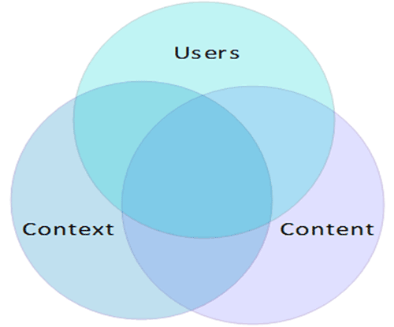
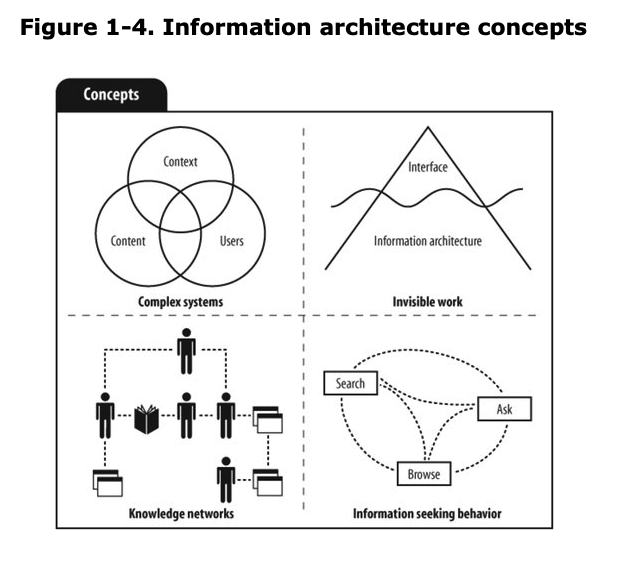
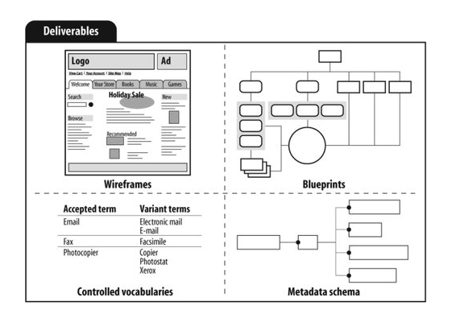
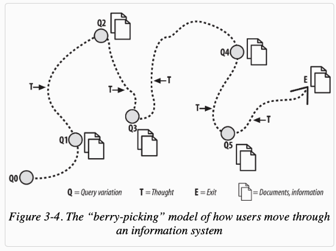
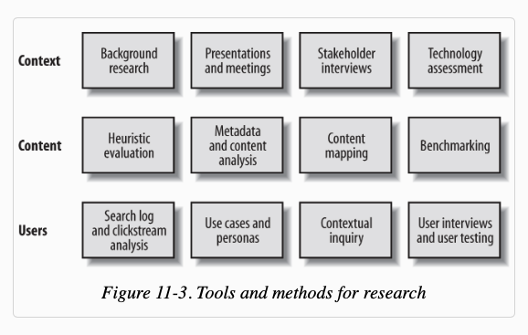
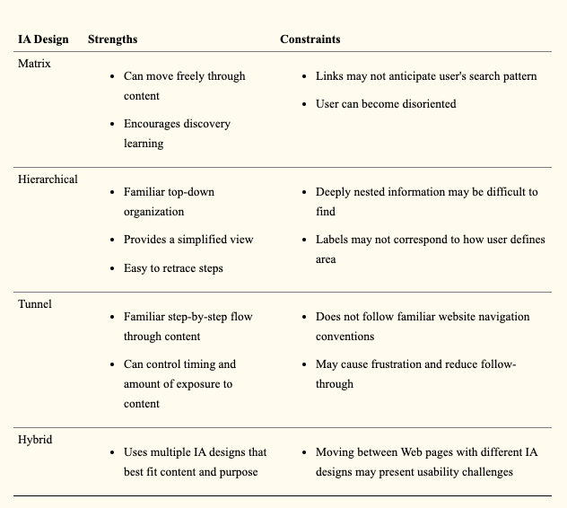

## Abstract

<div style="background-color: #f1f0f0; color: rgba(0, 0, 0, 1); padding: 1rem;font-style: italic;text-align: justify;">
My Ph.D. involves creation of adaptive Internet-Delivered Intervention for mental health problems using ICT.  There are two important perspectives here: adaptive system and Internet-Delivered Treatment application (Both mobile application and web application).  Like any developer would do, and having eight years for web development background, I completely dived into programming. Created a web application with basic authentication/authorization systems, and a comprehensive dashboard for therapists/psychologies/mental health practitioners. Having done that, I was quite product of my achievement and went to demonstrate my results to my supervisors. Well, the response what not what I had in mind?
	- How have you defined your domain? Can you explain your model?
	- How can user find information? How does user know which information is being presented?
	- Can you explain the architecture of the application?
	- Have you defined workflow model?

And many more. Well, being full stack web development/ frontend development these not very new terms for me. However, it is important when you present your work to anywhere. The reason is very obvious. As a developer, I can see my hard work, and probably I am clear in my brain how data flows in my small prototype. But it was not clear to my supervisors. Not only because they are much experienced in theoretical aspects but also because code is difficult to market compared to graphical stuffs. Secondly, they suggested me to draw workflow model, domain model, using formal modeling language, draw information architecture.

</div>

### Keywords:

Software service architecture, RESTful, GraphQL, GraphQL architecture, Query, mutations, resolvers.

## 1. Introduction

I started digging into modeling, model driven software engineering and information architecture. I found two papers and 4 books:

- Information Architecture 4E (Peter Morville, Louis Rosenfeld, Jorge Arango)
- Information Architecture for the World Wide Web (Louis Rosenfeld, Peter Morville, Jorge Arango)
- User-centered design (Travis Lowdermilk)
- Information Architecture: Blueprints for the Web (Christina Wodtke)

As a part of Ph.D., it is essential to gain both theoratical and practical knowledge. I bought all 4 books and started digging into the theoretical aspects to understand the main principle, concept behind Information Architecture (IA). In this post, I am going to walk you through, the main foundation behind IA in simple way as possible. The content from this post is based on these books, papers and blogs.

Information Architecture (IA) is associated with how people cognitively process information in any Information systems. IA assists experts in the content structuring making it comprehensible and discoverable for the Information Systems users. An American architect and graphic designer, Richard Saul Wurman, is considered to be a founder of the IA field. Currently, there are many specialists working on IA development (https://www.iainstitute.org/what-is-ia).

## Why should we care about IA?

Current WWW contains a massive amount of information which is hard to structure. Consider following facts:

- According to the executive summary published by IDC(https://www.emc.com/leadership/digital-universe/2014iview/executive-summary.htm, 2014), data is growing at a rapid pace and by 2020, the information generated by an individual person will approximate to 1.7 megabytes per second.
- The same report says, by 2020, the accumulated volume of data will increase from 4.4 zettabytes to 44 zettabytes.
- According to a report by ZDNet in 2015, (https://www.zdnet.com/article/the-internet-of-things-and-big-data-unlocking-the-power/, 2015), data scientists originally predicted the volume of data to be doubled every two years reaching 40 zettabytes by 2020. The number later bumped to 44 zettabytes taking IoT into considerations.
- A report by Techcrunch(https://techcrunch.com/2015/06/02/6-1b-smartphone-users-globally-by-2020-overtaking-basic-fixed-phone-subscriptions/, 2015) reports there will be 6.1 billion smartphone users by 2020.
- According to CISCO (https://www.cisco.com/c/en/us/solutions/internet-of-things/overview.html, 2015), in just five years, the quantity of smart connected devices will be more than 50 billion.

These statistics reveals prevalence of data and information available today in terms of smartphones, IoT, activity monitoring systems, and other Internet-enabled devices. IoT and smart sensors powered ambient technologies have started to make our life better in many ways, however, it also introduces tremendous challenges. With such massive information available in place, it becomes complex to store, find and understand information readily. IA is the design principle that is inclined on making information discoverable and comprehensible. It solves information explosion by two different perspective:

- It reveals that our products and services are received as places made of languages.
- IA helps to make information residing in our IS discoverable and comprehensible.

Why IA matters?

- Cost of finding information is high.
- The cost NOT finding information might be even higher.
- The value of educating your customers about your new products
- The cost of construction is very high
- The cost of maintenance
- The cost of training
- The value of branding

## What is Content Structuring?

IA is concerned with creating organisational and navigational schemes that allow the user to move through site content efficiently and effectively. The main objective of IA on the web is information retrieval:

- the design of the web applications should allow users to find information seamlessly.
- In addition to this, IA categorise the content into several sections providing fast access to the information. Such categorisation can be seen in two distinct ways:
  - top-down approach and
  - bottom-up approach.

### Top-down approach

It involves creating the architecture directly directly from an understanding of strategy plane considerations: product objectives and user needs. This approach starts with a broadest categories of possible content and functionality required to accomplish the strategic goals, and then breaking down the categories down into logical sub-categories.

### Bottom-up approach

A bottom-up architecture to IA derives categories and sub-categories by analyzing the content and functional requirements. Starting with the source material, items of the contents are grouped into logical categories, and then group those into higher level categories forming a structure that reflects our product objectives.

## What is all about?

It is about:

- Information design: Information of websites, documents, software systems, images, mobile applications and more.
- Structuring, organising and labelling: Structuring into appropriate level of granularity. Organising is the process of grouping common components into logical and distinctive categories. Labelling means figuring out what to call those categories and the navigation structure element that lead to them.
- Finding and managing: Finding the correct information is the most crucial part of Information System. If user can not find right information by using browsing, searching and asking then Information System fails. Hence, organization is an important aspect.

## Components of IA

Information ecology [3] describes three major components of IA - user, content and context. Most of the studies uses these components to argue about IA.



### Users

Users need information. This is the reason why they visit your Information Systems. This is the most important truism. Hence, it is essential to understand who end users are. In addition to this, we need to understand their needs. For example, a senior doctor using a medical system has different search preferences than a nurse. The administrator of the same system may need to access all the documents. In the same way, a manager just needs to get executive summary of the systems. Hence, understanding the users, their preferences, behaviours, level of access, roles and permission is essential in defining the structure of the system, search layout, content structure as well as designing adaptive content and layout. Having said that, what are the important questions that should be answered here:

- Do you know who's is using your system?
- Do you know how they are using it?
- Do you know what information they want from your system?

### Context

Why is understanding context essential? Well, the most important argument that I can make here is, it answers the question, "what makes your system unique?". Understanding business context correctly answers this question. Believe it or not, all digital systems have an organisational or business context, whether implicit or explicit. Each system has a goal, a mission, some strategy, staff, processes and procedures, physical systems, technology infrastructure, budget, and culture. This collective capabilities form a unique business context for your application.

## Content

Content is anything including documents, applications, schema, tables, meta data, figures, texts etc that end users are interested in. Some of the important aspects of the contents are:

- Ownership: Who owns the content?
- Format: What is the format in which the content is delivered in?
- Structure: How is the content structured? XML, JSON, HTML, RDFs etc.
- Metadata: Do you provide meta information with the content?
- Volume: How much content are you delivering?
- Dynamism: How much new information can user get every year/every month/every week/every day?



## A use case

An adaptive web application system for Internet-Delivered Interventions for mental health illness

### Users

- **Who are my end users?** People suffering from mental health morbidities like depression, social anxiety, bipolar disorder, OCD, eating disorder, stress, dementia, schizophrenia and others.
- **How can they use our information system?** Our system will provide Internet-delivered interventions that are carefully designed by medical domain experts. End users can learn about their illness, self-access their status, take interventions, monitor their progress and evaluate the interventions, discuss with peer groups and manage their illness.
- **What information end users want from our system?** Broadly, information about how can they manage their illness. In addition to this, then need a way they can motivate their mental status, a way in which they feel they are not only person suffering from such morbidities. In addition to that, they need to know what and why such illness is happening to them, as well as some measure that can be taken in order to reduce them.

### Context

- **Mission**: Improve public mental health with innovative ICT. We aim to bridge the gap between the burden of diseases and unmet needs by integrating innovative ICT and psychological treatments.
- **Strategy**: Through innovative ICT, web applications, mobile applications, VR applications and IoT.
- **Procedure**: Through research understand the need of users, understand how these needs can be fulfilled from domain experts, present the need to software engineers and create a usable prototype, evaluate the prototype with RCT techniques and disseminate the results to the world to get feedback.
- **Infrastructure**: Internet/SmartPhones/Computer
- **Why?** There are 350 million people suffering from mental health morbidities. Managing such mental health issues is both socially and economically challenging. Statistics show a lot of people suffering from mental health illness do not have access to treatments/interventions both because it is not accessible and it is expensive. With prevalence of smartphones and Internet in current world, if we can provide Internet Delivered Interventions, it would be accessible to every people people at reduced cost.



### Content

- Ownership: INTROMAT team
- Format: Text, audio, video, images, VR applications
- Structure: Through web/mobile application in formatted HTML and received by JSON through RESTful API.
- Metadata: All the content is structured using HL7 FHIR format and contains meta data information with correct code standards like SNOMED-CT, LOIC codes etc.
- Volume: Based on the interventions created.
- Dynamism: Some content are presented on tunnel based approach where new content is available every week based on the completion of the users.

# Design for users

Information architecture is not limited to designing database, taxonomies, search engines, choice of programming languages or layout, it starts with people. There is a reason why people come to your site: they need for information. Hence, it is essential to understand those needs and behaviours and shape our design that correspond according to their need. There is no goal more crucial than designing information architecture that satisfies people's need.

Again back to our example application for mental health interventions. A patient suffering from depression may be searching for symptoms related to depression and correlate these symptoms with their own symptoms to comprehend their own status. Then our system should allow searching for symptoms, readily and easily. In fact, when user search about symptoms about depression, how about presenting self-assessment questionnaire using MADRAS-S or PHQ-9; which are standard questionnaire for assessing depression. These needs are example for information-seeking behaviours of the users. Distinguishing between these needs and behaviours and determining which of our users' need has highest priorities is an extremely valuable insight. It not only helps the users but also provides valuable business intelligence to the information system owner.

## Information Need patterns

- _Known-item seeking_ (The perfect catch): Situations where users are looking for perfect answer. How many modules are used in IDT for depression?
- _Exploratory search_ (Lobster trapping): Situations where users need more than just a single answer. For example, online interventions for Depression. When a user is search for such information, probably the user is interested in how long interventions last? Is there any pricing involved? How effective is IDT for previous users? Is there any reviews given by people suffering from actual Depression? In this case, the user is not looking for perfect answer but several related answer. Whatever useful information they can locate, they are good enough.
- _Exhaustive search_: Sometime user performs exhaustive search. Situations where a researcher is studying about the effectiveness of IDT on depression, or the user is searching for cheaper and effective treatment for mental health issues for friends and families. In such situations, user wants to turn every stone and get all useful information they can grab.
- _Need-it-again search_: Situations where users are looking for information in their busy schedule and bookmarks it for later references. Informations seeking during office work.

## Information seeking pattern

### Integration

We integrate searching, browsing and asking technique to find right information. For example, in an IDT, a user first searches about interventions for Depression, if the user finds correct information, the search is finished. If not, the user probably starts browsing the website, going through the navigational links one by one. If browsing does not give them the most relevant information, they will go further and ask the support team/contact team by emailing them/calling them. Information architecture should be designed to support this.

Browsing:

- Organisational systems (top taxonomies)
- General navigation systems (Primary navigation within an environment)
- Local navigation systems (Breadcrumbs, primary navigation within a document)
- Sitemaps
- Indices (List of links within a documents)
- Guides
- Walkthrough and wizards
- Contextual navigations system

Searching:

- Search interface
- Query interface
- Query builders
- Retrieval algorithms
- Search zones
- Search results

Contents

- Headings
- Embedded links
- Embedded metadata
- Chunks
  - Texts
  - Pictures
  - Videos
  - Audios
- Lists
- Sequential aids
- Identifiers

### Iteration

Another information seeking behaviour perspective is, iterative approach. User might not get exact information in first time. But when searching, browsing and asking, our information system can recommend them something that is useful.

### Information seeking Models

1. Berry-picking model: Developed by Marcia Bates of University of Southern California.



- The end users starts with an information need, formulate an information query and move iteratively throughout the information system along complex path picking up some information.
- Amazon.com, ebay.com provides such berry picking model.

2. Pearl-growing model: User starts with one or a few good documents that are exactly what they need. They want more like this one. To meet this need, they perform search on search engines. Search engines provides similar pages which are indexed under the similar keywords. Such models can be seen in academic publication sites. If you are looking at a research paper, a list of recommended articles, using similar abstract, title and keywords are recommended. Flickr and Delicious are two examples that uses such information seeking model.

# Anatomy of an Information Architecture

## Visualising information architecture

Visualisation helps top-business stakeholders and non-technical audience to see and understand basic premise of information architecture. In addition to this, visualisation is important as several studies indicates graphical illustrations are easily marketable.

## Types if IA

- Top-down IA
- Bottom-up IA

## Components

### Organization system

We organise information so that people can find right answers to their questions, give them context to understand those answers. The freedom to publish on Internet has provided users to create and disseminate information without much organisational paradigm included in it. Why organising information is useful but challenging?

- Because it reduces ambiguity in finding information.
- Reduce heterogeneity in the information.
- Labelling and organization system are intensely affected by the creators' perspectives [4]. Difference in perspective makes information organisation a difficult task.
- Internal politics of an organization makes it difficult to agree on a consistent information architecture. For example, in IDT, a designer might find appealing to have breadcrumbs on the top of the page, but an interaction expert would like to reduce the number of ways user interacts with the system to be minimal in order to reduce confusion.

#### Organization schemas

- Alphabetical
- Chronological
- Geographical
- Task-oriented schemes
- Audience-specific schemes
- Hybrid scheme

#### Organisational structure

- The Hierarchy: Top-down approach
- The database model: bottom-up approach

### Labeling system

Labelling is a form of representation. For example, "contact us" is a label that represent larger chunk of content including contact name, address, phone number, email address and message.

#### Why should we care about it?

Labels are often the most obvious way to clearly show the user your organization and navigation schemes across multiple systems and context. Labels educate people about our information system, new concept and help them quickly to identify and find information.

Different forms:

- Contextual links
- Headings
- Navigation system choices
- Index terms

Consistency in labelling system is affected by:

- Style
- Presentation
- Syntax
- Granularity
- Comprehensiveness
- Audience

Creating new labels:

1. Content analysis

- Content creators/authors
- Domain experts

2. Directly from users

- Card sorting: Allow users to cluster labels for existing content into their own categories.
- Free listing

3. Directly from users

- Search log analysis: Analyze users search queries and label the most frequently searched categories.

4. Search Engines: Use Google AdWords to see the most frequent search terms used by people.
5. Hit and Trial methods

### Navigation systems

- Global navigation system
- Local navigation system
- Contextual navigation
- Supplemental navigation systems
  - Sitemaps
  - Indexes
  - Guides
  - Search
- Advanced navigation systems
  - Personalised and customisation
  - Visualisation (Visual search navigation)
  - Social Navigation (Value for an individual user can be derived from observing the actions of other users)

### Searching systems

It is a mechanism of finding relevant information. There are different types of search algorithms.

#### Does your system need search feature?

- Amount of content in the information environment
- Focus on more useful navigation systems (Search engines are band-aid for poorly defined navigation systems)
- Time and know-how to optimize the search system
  - It is easy to implement but difficult to maintain. So, if you are not planning to maintain in long run, it is time to re-consider your decision.
- Other alternative
  - May be indexing
  - Third party search engines like Google/Algolia search

Other types of search algorithms:

- Query builders (Phonetic tools, stemming tools or NLP tools)

Search Accuracy

```
Precision Ratio = Number of relevant documents retrieved/Total number of documents retrieved
Recall ratio = Number of relevant documents retrieved/Total number of relevant documents in the system

```

# Is IA and UX design same?

Technically both of these terms relate to each other but they are not the same. IA is the blueprint of the design structure which can be generated into wireframes and sitemaps of the project. IA can be used by UX designers to create initial design and navigational systems.

IA focuses on the users' goals. UX is much more than content structuring, its objective is to make pleasant interaction model so that the users' feel comfortable using the product.

# Information architecture development

Research => strategy => Design => Implementation => Administration

Research: Review of existing background materials and meeting with the strategy team, aimed at gaining a high level understanding of the goals and business context. It provides contextual understanding that forms the foundation for development of an IA strategy.

Strategy: It defines the highest two or three levels of the information environment's organization and navigation structure. It provides high-level framework for the IA.

Design: Shape a high-level strategy into an IA, creating detailed sitemap, wireframes, and metadata schema that will be used by UX designer, programmers, content authors and production team.

Implementation: System building phase where the designs are put into action.

Administration: Continuous evaluation and improvement of the system's IA.



# IA Designs

## Tunnel Based

Users follow step-by-step approach in a sequential fashion. For example, while watching a TV series, purchasing an item from Internet Stores, online hotel bookings, online surveys, and others. Almost all e-learning courses are based on tunnel design. Nielsen, a noted Web usability authority, has argued that “…one of the Web's most powerful features is that it lets users control their own destiny. Users go where they want, when they want.... Websites that force users to sit through sequences with nothing to do will be boring and pacifying, regardless of how cool they look” [5].

The linear model is familiar because it is consistent as in movies, textbooks, academic classes, and multiple clinical sessions. The main argument is of its effectiveness is, tunnel based design presents content in sequential steps and is less likely to overwhelm users with information and options.

The tunnel IA design is particularly well-suited to fostering the type of dialog that can be associated with multi-session program in which users are assigned task to do at home on their own in between online sessions.

Example:

- Lange Alfred, Rietdijk Deirdre, Hudcovicova Milena, Van De Ven Jean-Pierre, Schrieken Bart, Emmelkamp Paul M G. Interapy: a controlled randomized trial of the standardized treatment of posttraumatic stress through the internet. J Consult Clin Psychol. 2003 Oct;71(5):901–9. doi: 10.1037/0022-006X.71.5.901.2003-07816-007 [PubMed: 14516238] [CrossRef: 10.1037/0022-006X.71.5.901]

## Free-form matrix design

Information Systems with matrix IA is designed on the principles of hypertext HTML [6, 7]. In this design IA, users are free to pursue their idiosyncratic interests by using their own path through available content. Such design can be found in government sponsored websites focussed on broad health topics.

The main rationale of its use is, matrix IA offers the maximum amount of information within a system. However, the efficiency is associated with how well the links anticipate users preferences. However, the freedom of movement can be costly as users can quickly become disoriented from original search queries. Lynch and Horton suggested, that a web application with a matrix IA may not be well-suited for helping users. Instead, it should be most applicable for small websites that are designed for highly educated and experienced users who are already familiar with the basic organization of the content and who are visiting in order to obtain further education or enrichment.

## Hierarchical Design

Information is organised in top-down manner so that users can review increasingly detailed content. The users is presented with small chunks of information that he/she rapidly explore in a non-sequential manner.

Web applications with such design tend to reduce the kind of confusion that comes from users being presented with too many links and options.

## Hybrid Design

It is combination of one more more IA designs. Hybrid designs have several advantages over websites that offer only the more orthodox matrix or tunnel design. It allows the users to break free from lock-step sequence of pages found in a tunnel design.



# Criticism

IA models information not relationships. Many of the artefacts of IA creation is based on sitemaps, navigations systems, taxonomies and information model are based on the assumptions that a single way of organisation can suit all users. One IA to rule them all. For example, Google's page rank algorithm was based on folksonomy, compared to Yahoo Directory information architecture model which ultimately become obsolete.

- Rivals: Interaction Design raised a campaign against IA.

# References

1. “Bates’s seminal paper, “The Design of Browsing and Berry-picking Techniques for the Online Search Interface” in Online Review, vol.13, no.5, 1989, is required reading for every information architect. See http://www.gseis.ucla.edu/faculty/bates/berrypicking.html.”
2. “For more on contextual inquiry, read Beyer and Holtzblatt’s Contextual Design: Defining Customer-Centered Systems (Burlington, MA: Morgan Kaufmann, 1997).”
3. “For more on contextual inquiry, read Beyer and Holtzblatt’s Contextual Design: Defining Customer-Centered Systems (Burlington, MA: Morgan Kaufmann, 1997).”
4. “For a fascinating study on the idiosyncratic methods people use to organize their physical desktops and office spaces, see T.W. Malone, “How Do People Organize Their Desks? Implications for the Design of Office Information Systems,” ACM Transactions on Office Information Systems 1 (1983)”
5. Nielsen J. Flysh: 99% Bad. Alertbox; 2000. [2005 Apr 8]. http://www.useit.com/alertbox/20001029.html.
6. Nelson Ted. Web history. Living Internet. [2005 Apr 26]. http://livinginternet.com/w/wi_nelson.htm.
7. Berners-lee T. Information management: a proposal. W3 Archive. 1990. [2005 Apr 26]. http://www.w3.org/History/1989/proposal.html.
