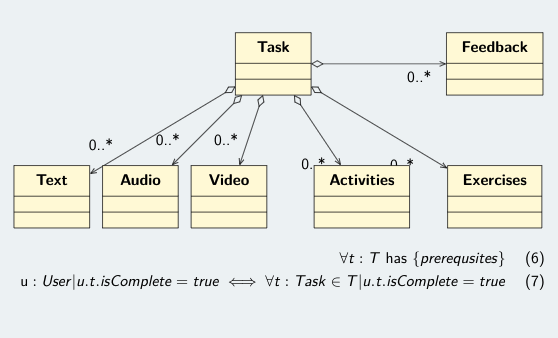

## Abstract

<div style="background-color: #f1f0f0; color: rgba(0, 0, 0, 1); padding: 1rem;font-style: italic;text-align: justify;">
In this article, we will discuss about design patterns in brief and discuss one of the creational design pattern named as Factory Method Design Pattern. We will discuss when it is relevant to use Factory Design pattern and when it is not. Finally, we will implement a use case scenario for Factory Design Pattern in Python 3.
</div>

#### Keywords:

Design pattern, Factory Design Pattern in Python, Creational Design Pattern, Example of Factory Design pattern in Python

### Introduction

Design patterns define tried and tested solutions to various recurring problems in software development. Broadly, design patterns are divided into **creational patterns**, **structural patterns**, and **behavioral patterns**.

#### Why should we use design pattern?

In a nutshell, Design pattern provides two major benefits: a) They provide a mechanism to solve issues related to software development using a proven solution, b) the solution facilitates the development of highly cohesive modules with minimal coupling. Here are the list of other benefits of design patterns in general:

- Design pattern give the developer a selection of tried and tested solution to work with.
- They are independent of any programming language. Hence, it can be applied to any programming languages that support OOP paradigm.
- They have a proven track record as they are already widely used and thus reduce the technical risk of the project.
- They are flexible and can be used practically in any type of application domain.
- They help in communication as they are well documented and can be researched if that is not the case.

The _Factory Method Design Pattern_ is a type of creational design pattern. And in this article, we will discuss in detail about it.

### Example implementation

Consider a use case from a software that I have been developing for Internet-Delivered Psychological System (IDPT). Generally, consider it as a typical CMS system where, an object `Task` can be `audio`, `video` or `text`. Check the UML diagram given below:

 

We start by creating `abstract class` to represent generic `task`. Look at the implementation code given below.

```python
# Import Abstract Base Class
import abc

class Task(metaclass=abc.ABCMeta):
  @abc.abstractmethod
  def total_duration(self):
    pass

  @abc.abstractmethod
  def required_duration(self):
    pass

  @abc.abstractmethod
  def display(self):
    pass
```

This is the `base class` for all our tasks. When we say `abstract class`, we define the placeholder attributes and properties that should be implemented by child classes.

Now, let us go ahead and install some of the dependencies that we shall be using during the class implementation. I am going to use `faker`, `lorem-text` and `readtime`. Let us install them right away.

```python
!pip install faker
from faker import Faker
fake = Faker()
```

Also, install `lorem-text` and `readtime`.

```python
!pip install lorem-text
!pip install readtime
```

Now, let us go ahead and create several `concrete`, more specific `task` classes. Note, as shown in the UML diagram above, `TEXT`, `AUDIO`, `VIDEO` are the types of `TASK`.

```python
import random
import readtime

class Text(Task):
  def __init__(self, id, htmlText):
    self.id = id
    self.htmlText = htmlText

  def total_duration(self):
    return readtime.of_text(self.htmlText)

  def required_duration(self):
    return self.total_duration()

  def display(self):
    return self.htmlText


class Audio(Task):
  def __init__(self, id, link):
    self.id = id
    self.link = link

  def total_duration(self):
    return '2 min'

  def required_duration(self):
    return '2 min'

  def display(self):
    return self.link

class Video(Task):
  def __init__(self, id, link):
    self.id = id
    self.link = link

  def total_duration(self):
    return '4 min'

  def required_duration(self):
    return '4 min'

  def display(self):
    return self.link
```

So far, we have created an abstract class `Task` and extended it to three other classes namely `Text`, `Audio` and `Video`. In order to create the different sub-classes, client will have to know the names and details of the shapes and separately perform the creation. This is where the Factory method comes into play.

The factory method design pattern will help us to abstract the available shapes from the client. It allows us to centralize and encapsulate the object creation.

Now, let us create a factory named, `TaskFactory` that will help us create the specific `Task` classes based on the client input.

```python
from lorem_text import lorem

class TaskFactory:
  def create_task(self, name):

    if name == 'text':
      id = random.randint(1, 1000)
      htmlText = lorem.paragraph()
      return Text(id, htmlText)
    elif name == 'audio':
      id = random.randint(1, 1000)
      link = fake.hostname()+'/audio/listen.mp3'
      return Audio(id, link)
    elif name == 'video':
      id = random.randint(1, 1000)
      link = fake.hostname()+'/video/video.mp4'
      return Video(id, link)
```

This is the interface for creation. We do not call the abstract class, instead we call the factory and ask it to create a `Task` for us. For example, if we want to create a `Video` task, then we can initiate the Factory as given below:

```python
factory = TaskFactory()
xx = factory.create_task('video')
xx.display()
```

The output of the above code is given below. Please note, since, I have used the `faker` to generate some data, the output you might get can be different from the one I have below:

```
desktop-19.hicks-clark.net/video/video.mp4
```

### Advantages

- The code becomes loosely coupled. That is to say, one component of the codebase are unaware of the other component.
- The code is easy to understand and test.
- Extendability is easier as we can add more functionality to specific components without affecting or breaking the entire program.
- Factory method supports [SOLID](<https://en.wikipedia.org/wiki/SOLID_(object-oriented_design)>) principle where each classes and objects handles one specific functionality.

### Disadvantage

- Factory method entails to create more classes which eventually leads to less readability.

In conclusion, the Factory Method Design Pattern allows us to create objects without specifying the exact class required to create the particular object. This allows us to decouple our code and enhances its reusability.

It is important to note that, just like any other design pattern, it is only suitable for specific situations and not every development scenario. An assessment of the situation at hand is crucial before deciding to implement the Factory Method Design Pattern to reap the benefits of the pattern.
