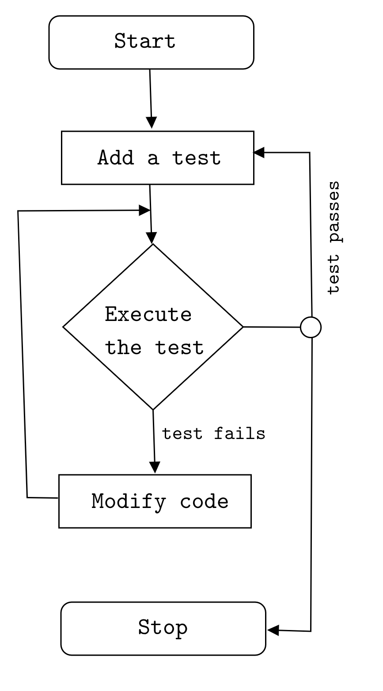

## Abstract

<div class="abstract" style="background-color: #f1f0f0; color: rgba(0, 0, 0, 1); padding: 1rem;font-style: italic;text-align: justify;">
I recently had a job interview with a enterprise company. The interviewer asked me about, what is difference between TDD and BDD? I answered him gently that both of them are system development approaches. TDD focuses mainly on testing the implementation whereas BDD focuses mainly on testing the behaviour of the feature. TDD is a development practice whereas BDD is a team methodology. After interview, I wanted to reverify that what I answered was correct. I googled, the question was surprised to see several blog posts answering the question in their own way. I don’t want to point out any blogs here, but I decided to point out my understanding in my blog. Hope, I will be able to convince you with my answer.
</div>

#### Keywords:

Test Driven Development, Behaviour Driven Development, Acceptance Test Driven Development

### Test Driven Development (TDD)

TDD<sup><a href="#fn3" id="ref2">3</a></sup> is a software development technique. In this development technique, we create _test cases_<sup><a href="#fn1" id="ref1">1</a></sup> first, and then we write the code underlying those test cases. Three important points to remember when talking about TDD are:

- It means writing tests that fail because the functionality does not exits.
- It is a development practice.
- Developers write the tests.
- Main focus: Unit testing

<!-- <style>
figure {text-align: center; width: 30%; margin: 0px auto; }
</style> -->
<figure>
    
    <figcaption>Flowchart illustrating test driven development</figcaption>
</figure>

TDD process is simple and straightforward. We start by writing a test. We execute the test and watch it fail. We modify the code and re-execute the code. If test passes, we can either stop or add new test. If test fails, we modify the code until, the test passes.

TDD methodology follows a simple 6 step process:

1. <mark>Write a test case:</mark> Based on the requirements, write an automated test case.

2. <mark>Run all the test cases:</mark> Run these automated test cases on the currently developed code.

3. <mark>Develop the code for that test cases:</mark> If the test case fails, then, write the code to make that test-case work as expected.

4. <mark>Run test cases again:</mark> Run the test cases again and check if all the test cases developed so far are implemented.

5. <mark>Refactor your code:</mark> This is an optional step. However, it’s important to refactor your code to make it more readable and reusable.

6. <mark>Repeat the steps 1- 5 for new test cases:</mark> Repeat the cycle for the other test cases until all the test cases are implemented.

<blockquote>
  Don’t be confused TDD or BDD with Domain Driven Design (DDD). Domain-driven design (DDD) is the concept that the structure and language of software code (class names, class methods, class variables) should match the business domain.
</blockquote>

# Behaviour Driven Development (BDD)

BDD is regarded as an extension of TDD where instead of writing test cases, we start writing executable specifications. Later, we write the code which is required to abide by these specifications. Four essential points you need to remember about BDD are as follows:

- It means writing executable specifications that fail because feature does not exits.
- It is team methodology.
- Executable specifications are written by developers, users or testers.
- Main focus: Understanding requirements

## BDD process

The process involved in BDD methodology consists of 6 steps and is similar to that of TDD.

1. Write the behavior of the application: The behavior of an application is written in simple English like language by the product owner or the business analysts or QAs.

2. Write the automated scripts: This simple English like language is then converted into programming tests.

3. Implement the functional code: The functional code underlying the behavior is then implemented.

4. Check if the behavior is successful: Run the behavior and see if it is successful. If successful, move to the next behavior otherwise fix the errors in the functional code to achieve the application behavior.

5. Refactor or organize code: Refactor or organize your code to make it more readable and re-usable.

6. Repeat the steps 1-5 for new behavior: Repeat the steps to implement more behaviors in your application.

#### Example of executable specifications

```
Context: Login page
Event: Enter username and password and hit Login button.
Outcome: I am logged into the user dashboard page.
```

# ATDD (Acceptance Test Driven Development)

- It is similar to BDD, however BDD focuses mainly on behaviour of a feature where as ATDD focuses on capturing the accurate requirement.
- It is a team methodology.
- Developers, customers, WAs
- Main focus: Writing acceptance tests

# TLDR

<table>
<thead>
  <tr>
    <th class="tg-fymr">Criteria</th>
    <th class="tg-0pky">TDD</th>
    <th class="tg-0pky">BDD</th>
  </tr>
</thead>
<tbody>
  <tr>
    <td class="tg-fymr">Definition</td>
    <td class="tg-0pky">It is a development technique that focus on the implementation of a feature.</td>
    <td class="tg-0pky">It is a development technique that focuses on the system's behavior. </td>
  </tr>
  <tr>
    <td class="tg-fymr">Philosophy</td>
    <td class="tg-0pky">It is development practice.</td>
    <td class="tg-0pky">It is team methodology. </td>
  </tr>
  <tr>
    <td class="tg-1wig">Participants</td>
    <td class="tg-0lax">Developer</td>
    <td class="tg-0lax">Developers, Customers, QAs</td>
  </tr>
  <tr>
    <td class="tg-1wig">Main Focus</td>
    <td class="tg-0lax">Unit testing</td>
    <td class="tg-0lax">Understanding requirements</td>
  </tr>
  <tr>
    <td class="tg-1wig">Language</td>
    <td class="tg-0lax">Programming language</td>
    <td class="tg-0lax">Simple English</td>
  </tr>
  <tr>
    <td class="tg-1wig">Aim</td>
    <td class="tg-0lax">Reduce bugs in implementation</td>
    <td class="tg-0lax">Reduce bugs in behavior of the system.</td>
  </tr>
</tbody>
</table>

If you landed on this blog without understanding software design and modelling tools, [you might want to stop it here and read this post first](/posts/2019-04-05--survey-about-mdse/survey-about-mdse/).

#### Which is the right fit for my company?

There is no right answer. Some developers might argue TDD is better than BDD, however, it depends on the person, the project, team lead and methodology. TDD gives you high code coverage <sup><a href="#fn2" id="ref2">2</a></sup> whereas BDD is better in finding the workflow bugs.

#### Glossary Alert

<p id="fn1"><em>Test cases</em>: In software engineering, a test case is a specification of the inputs, execution conditions, testing procedure, and expected results that define a single test to be executed to achieve a particular software testing objective, such as to exercise a particular program path or to verify compliance with a specific requirement. <a href="#ref1" title="Jump back to footnote 2 in the text.">↩</a></p>

<p id="fn2"><em>Code coverage</em>: In computer science, test coverage is a measure used to describe the degree to which the source code of a program is executed when a particular test suite runs. <a href="#ref2" title="Jump back to footnote 2 in the text.">↩</a></p>

<p id="fn3"> <em>TDD</em>: Beck, Kent. Test-driven development: by example. Addison-Wesley Professional, 2003.<a href="#ref3" title="Jump back to footnote 2 in the text.">↩</a></p>
